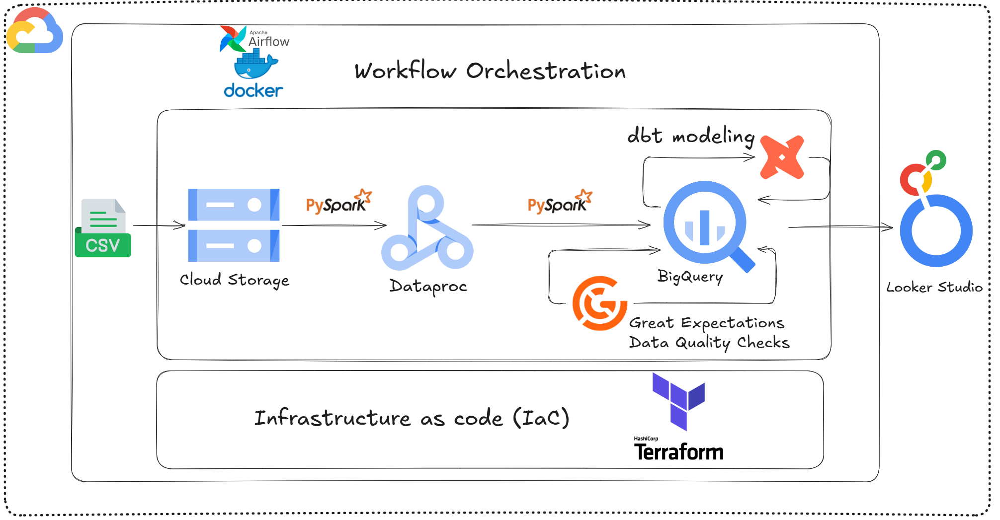
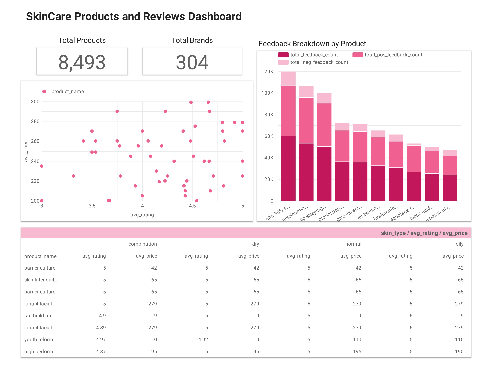

# 🌸 GCP Skincare Products Pipeline

This project implements an end-to-end data pipeline for processing skincare products and reviews data from Sephora, using **Google Cloud Platform (GCP)**, **PySpark**, **Docker**, **Airflow**, **dbt**, and **Terraform**.

---

 

---

### 📚 Table of Contents
- [Project Overview](#-project-overview)
  - [Dataset](#-dataset)
  - [Architecture](#-architecture)
  - [Technologies Used](#-technologies-used)
  - [Data Model](#-data-model)
  - [Dashboard](#-dashboard)
- [Setup](#️-setup)
  - [Prerequisites](#-prerequisites)
  - [Useful Commands](#-useful-commands)


## 📦 Project Overview

### 1. 🧾 Dataset

The dataset consists of:
- `product_info.csv`: contains product name, brand, category, price, ingredients, highlights ...etc.
- `reviews_1.csv` to `reviews_5.csv`: customer reviews with product ID, rating, feedback_count ...etc.

📥 **Download**: [Link to dataset](https://www.kaggle.com/datasets/nadyinky/sephora-products-and-skincare-reviews) *(or your hosted version)*

---

### 2. 🧱 Architecture

The pipeline includes the following stages:

1. Provision cloud infrastructure on GCP using IaC (Terraform)
2. Upload raw CSVs to a data lake (Google Cloud Storage)
3. Submit a PySpark job for transformation and cleaning (Dataproc)
4. Load processed data into a data warehouse (BigQuery)
5. Build a dimensional model using SQL (dbt using Cosmos)
6. Run data quality checks (Great Expectations + dbt)
7. Orchestrate the entire pipeline (Airflow via Astro CLI)
8. Visualize insights (Looker Studio)

---

### 3. 🛠 Technologies Used

| Tool / Language     | Purpose                                      |
|---------------------|----------------------------------------------|
| Google Cloud Storage| Store raw CSV files + Pyspark code           |
| Dataproc + PySpark  | Data transformation and cleaning            |
| BigQuery            | Data warehousing and SQL-based querying     |
| dbt                 | Data modeling and testing         |
| Great Expectations  | Data validation and testing                 |
| Airflow (Astro CLI) | Orchestration of the entire pipeline        |
| Terraform           | Provision and manage cloud infrastructure (IaC)|
| Docker              | Containerization of services                |
| Looker Studio       | Final dashboard for visualization           |

---

### 4. 🧮 Data Model

**dbt models:**
The dbt project follows a four-layer architecture:
- `source`:
  - `products`
  - `reviews`
- `staging`:
  - `stg_products`
  - `stg_reviews`
  - `stg_customers`
  - `stg_brands`
- `star_schema`:
  - `dim_products`
  - `dim_date`
  - `dim_customers`
  - `fact_care`
- `marts`:
  - `brands_rating`
  - `products_skin_type`
  - `rating_price_product`
  - `total_feedback_product`

---

### 5. 📊 Dashboard

The dashboard provides insights on:

- Average product prices and ratings by skin type  
- Most-reviewed skincare products  
- Distribution of product price versus rating


🖼️ **Dashboard Preview**:  
 


---

## ⚙️ Setup

### ✅ Prerequisites

- A Google Cloud Platform (GCP) account with a service account that has admin access to GCS, Dataproc, and BigQuery.
- Docker & Astro CLI installed (refer to the official Astro documentation).
- Python & PySpark installed.
- Terraform installed.

---

### 🧾 Useful Commands

#### Airflow
```bash
astro dev start (astro dev start --wait 3m)
astro dev bash
```
#### Terraform
```bash
cd terraform/
terraform init
terraform plan
terraform apply 
```
#### dbt
```bash
cd include/dbt
dbt deps
dbt run --profiles-dir /usr/local/airflow/include/dbt/ 
